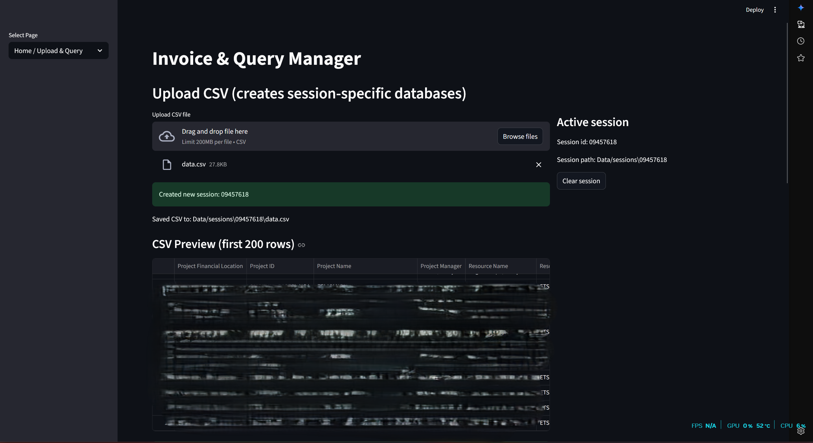
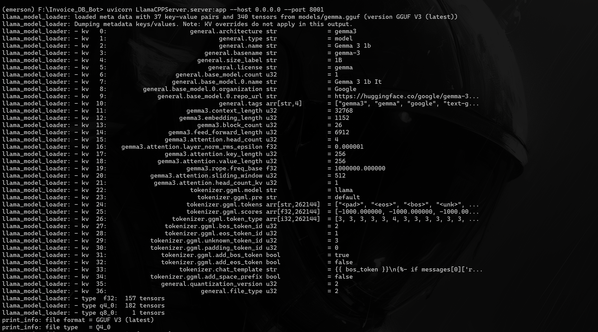

# Automated ERP System For Invoicing and Data Management.

This project is designed to streamline the invoicing process by integrating with existing ERP systems, utilizing advanced data processing techniques, and providing a user-friendly interface for managing invoices and related data.

The above image is a screenshot of the homepage of the application, showcasing its user-friendly interface and key features. However due to confidential data, the actual data is blurred out.

The above image shows how to run your own LLAMA CPP Server for local LLM inference. Implementing a local LLM server ensures data privacy and faster response times using FastAPI and llama.cpp. Remember to install the CPP toolkit if you're running this on Windows.